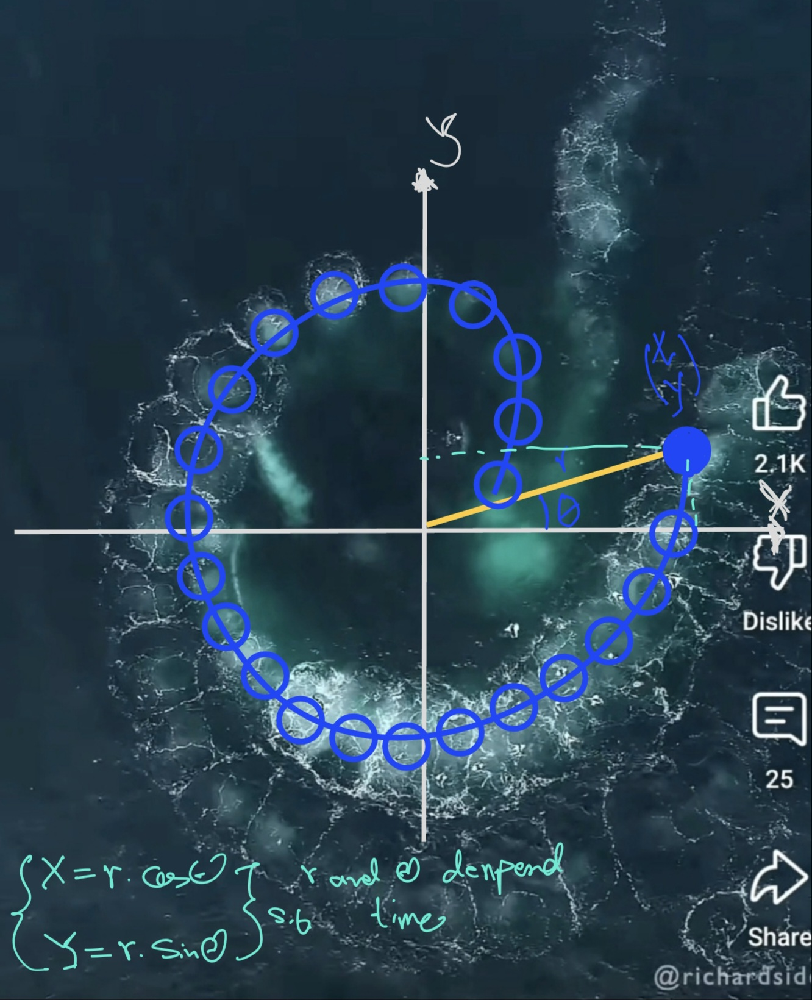
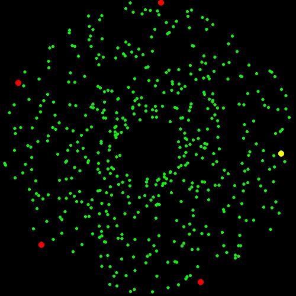
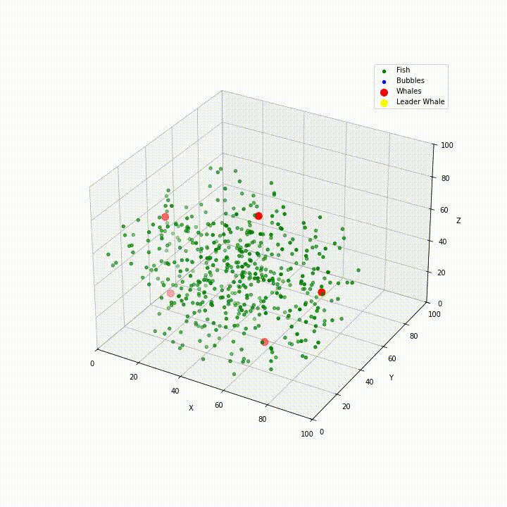

In the first try I would like to mimic Bubble Net Feeding (Humpback Whales).
Humpback whales work together to trap schools of fish (like herring) by blowing bubbles in a spiral pattern underwater.
This creates a "net" that confuses and concentrates the fish. My first observation and draft out of this behaviour was like this:

 

The whales then lunge through the bubble cloud with their mouths wide open to scoop up the prey.
- **In first try**, I worked on Bubble Net Feeding but the spiral behaviour is not correct or at some point something is not working. I have to check it !
- **The second attempt**, well it's working now :) 
I had to change the behaviours as follows:
  - Leader whale moves in a spiral around the fish cluster while releasing bubbles.
  - Bubbles push the fish toward the center.
  - Other whales follow the leader but position themselves around the fish to create a trap.
  - Once fish are grouped in the center, other whales stay positioned around them to catch them.
- **The thrid attempt**, i worked on a 3D environment and more realistic social behaviour of the whales. So for, I like it.By the way, I noticed in more a natural behaviour, other whales also do the spiral pattern.
- God, it's finally done. That was hurtful to teach the whales learn hunting when fish are circled enough that provide enough food for them. but it's done. Also, fish fear of then so whales have to not be so close not so far. 
  
  
 

