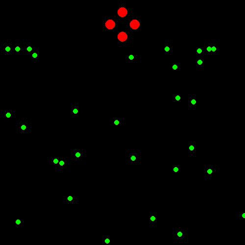

In the first try I would like to mimic Bubble Net Feeding (Humpback Whales).
Humpback whales work together to trap schools of fish (like herring) by blowing bubbles in a spiral pattern underwater.
This creates a "net" that confuses and concentrates the fish.
The whales then lunge through the bubble cloud with their mouths wide open to scoop up the prey.

**In first attempt**, I worked on Bubble Net Feeding but the spiral behaviour is not correct or at some point something is not working. I have to check it !

**The second attempt**, well it's working now :) 
I had to change the behaviours as follows:
  - Leader whale moves in a spiral around the fish cluster while releasing bubbles.
  - Bubbles push the fish toward the center.
  - Other whales follow the leader but position themselves around the fish to create a trap.
  - Once fish are grouped in the center, other whales stay positioned around them to catch them 

