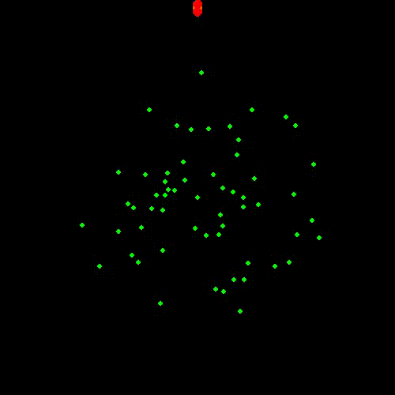
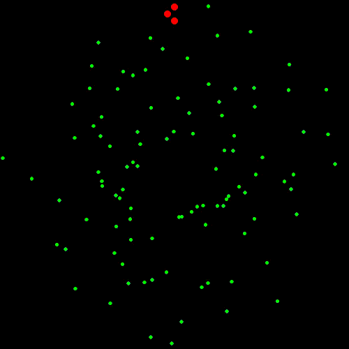
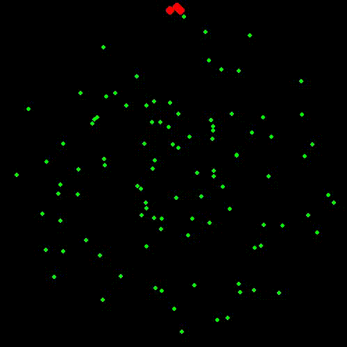

Echolocation is a biological sonar used by toothed whales (like dolphins, porpoises, and belugas) to navigate and hunt in their underwater environment. Here's how it works:
1) **Sound Production**: Whales generate high-frequency clicks using their phonic lips (also called "monkey lips") located in their nasal passages.
These clicks are then directed forward by a fatty structure in their heads called the melon, which helps focus the sound waves.
2) **Sound Propagation**: The emitted clicks travel through the water and bounce off objects, producing echoes.
The time it takes for these echoes to return helps the whale determine the distance of the object.
3) **Echo Reception**: The returning echoes are received primarily through the whale’s lower jaw, which contains a fat-filled channel that transmits vibrations to the middle ear.
The whale’s brain processes these signals to determine the size, shape, distance, speed, and even material composition of the object.

Then, based on my understanding of whales and their behavior, I developed the reinforcement learning model.

  -  First attempt (first picture): The whale couldn't detect the fish school. Echolocation failed.
  -  Second attempt (second picture): Echolocation works now and whales move toward them. But when they reach the end, they don't echolate anymore. If no more fish are detected, it turns randomly and echolocates again.
  -  Third attempt (last picture): So, when there is no more fish echolate again and turn toward them. And, well, it's working… at least based on my understanding!

  
