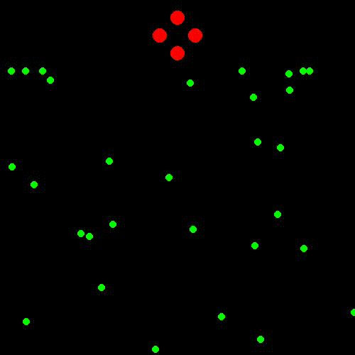

Those who know me also know about my obsession with the ocean, whales, and sea turtles. Nothing scientific or practical is happening in this repository—just some fun and an attempt to mimic mammal behavior🐋.

If you enjoy reading, you can refer to these two books:

  - Berta, A. (Ed.). (2020). Whales, Dolphins, and Porpoises: A Natural History and Species Guide. University of Chicago Press.
  - Perrin, W. F., Würsig, B., & Thewissen, J. G. M. (Eds.). (2009). Encyclopedia of Marine Mammals. Academic Press.
    
One of my favorite ocean scenes is watching whales hunt. So, here I’ll see what I can do and gain some experience along the way. In nature, whales have different hunting techniques depending on their species, prey, and environment. Here are some fascinating methods:
1. Bubble Net Feeding (Humpback Whales)
Humpback whales work together to trap schools of fish (like herring) by blowing bubbles in a spiral pattern underwater.
This creates a "net" that confuses and concentrates the fish.
The whales then lunge through the bubble cloud with their mouths wide open to scoop up the prey.
2. Lunge Feeding (Baleen Whales: Blue, Fin, Humpback, etc.)
These whales swim at high speeds toward a dense patch of krill or small fish.
They open their mouths wide, taking in massive amounts of water and prey.
They then push the water out through their baleen plates, trapping the food inside.
3. Echolocation & High-Speed Pursuit (Toothed Whales: Orcas, Sperm Whales, etc.)
Orcas (Killer Whales) use echolocation to track fish, seals, or even large whales.
They work in groups, coordinating attacks much like wolf packs.
Some orcas beach themselves temporarily to grab seals resting on ice or shorelines.
Others use tail slaps to stun fish or knock prey into the air.
4. Deep Diving & Ambush (Sperm Whales)
Sperm whales hunt squid at extreme depths (~1000m).
They use echolocation to find prey in the dark, then ambush them.
They have strong suction abilities to capture squid and fish.
5. Mud Ring Feeding (Bryde’s Whales)
Some whales swim in a tight circle, kicking up mud from the seafloor to trap fish in a confined space before gulping them down.
6. Wave-Washing (Orcas in Antarctica)
Orcas in Antarctica work in groups to generate waves, washing seals off ice floes and into the water, making them easier to catch

**In first attempt**, I worked on Bubble Net Feeding but the spiral behaviour is not correct or at some point something is not working. I have to check it !

**The seconds attempt**, well it's working now :) 
I had to change the behaviours as follows:
  - Leader whale moves in a spiral around the fish cluster while releasing bubbles.
  - Bubbles push the fish toward the center.
  - Other whales follow the leader but position themselves around the fish to create a trap.
  - Once fish are grouped in the center, other whales stay positioned around them to catch them 

